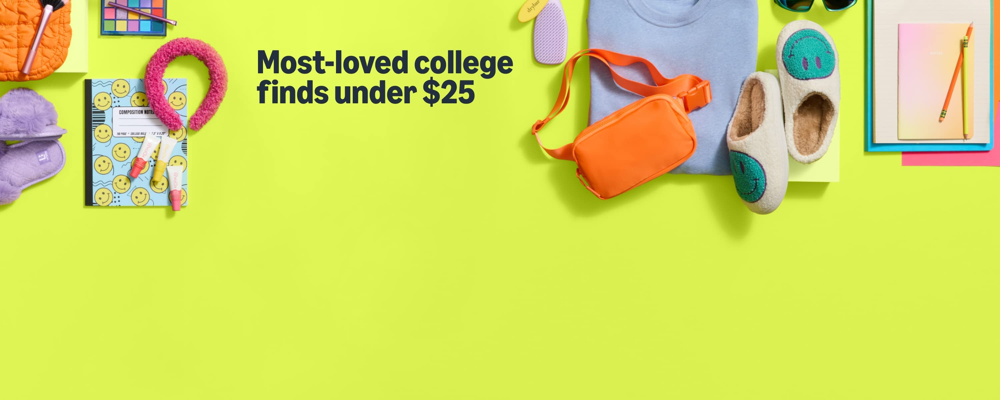

# Amazon Clone

A responsive Amazon.in homepage clone built with HTML and CSS.

## Features

- Responsive navigation bar with logo, search, language, and cart
- Hero section with promotional message and background image
- Product categories with images and "See more" links
- Best sellers section with product cards, ratings, and discounts
- Footer with useful links and "Back to top" button
- Fully responsive design for desktop and mobile

## Project Structure

```
index.html
styles.css
img/
  main.jpg
```

## Getting Started

1. Clone or download this repository.
2. Open `index.html` in your browser to view the site.

## Screenshots



## Credits

- Product and category images from [Pexels](https://pexels.com)
- Amazon logo and India flag from Wikimedia Commons
- Icons from [Font Awesome](https://fontawesome.com)

## License

This project is for educational purposes only and is not affiliated